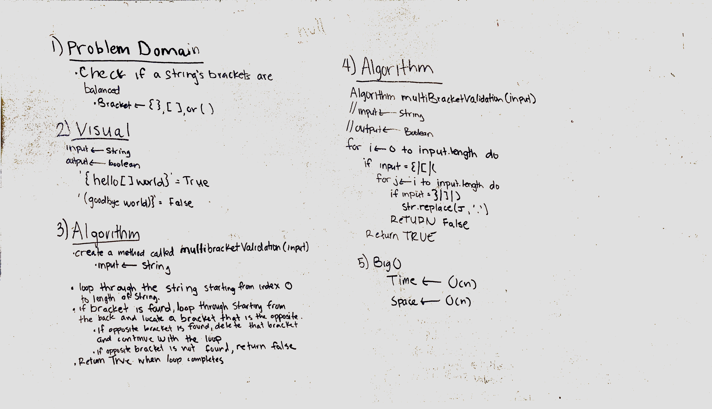

# data-structures-and-algorithms

## Reverse an Array
Reverse array method will take in an array in as an argument and return the array in reverse.

### Challenge
avoid using built in Javascript methods.

### Solution

## Insert and shift middle index of array
Takes two arguments (an array and any value) and inserts the value to the middle index of the array. If the array length is odd, the middle index will round up

### Challenge
create a method that inserts a value to the middle of the array and shifts the rest of the values accordingly. Avoid using built in array prototype methods

### Solution

## Binary Search
Takes two argumenets (a <b> sorted </b> array and a number(key)) and searches the array where the key and the index of the array match. The search will return the index of the array when found, if no matches are found, binary search will return -1.

### Challenge
create a method that searchs an array for the index where the array element matches the key. If no results found, return -1. Avoid using built in array prototype methods.

### Solution

## Array Adjacent Products 
Take a 2-Dimensional array and locate the largest product of two adjacent values in the array. Adjacent values can be horizontally, vertically, or diagonally. 

### Challenge
create a method that takes in a 2-Dimensional array as an input and find the largest product of 2 adjacent values. Avoid using built in array prototype methods.

### Solution

## Linked List Insertions
Create  append, insertBefore, and insertAfter methods for a singly linked list.

### Challenge
.append(value) which adds a new node with the given value to the end of the list
.insertBefore(value, newVal) which add a new node with the given newValue immediately before the first value node
.insertAfter(value, newVal) which add a new node with the given newValue immediately after the first value node

### Solution

### Solution

## Linked List Insertions
Create  append, insertBefore, and insertAfter methods for a singly linked list.

### Challenge
.append(value) which adds a new node with the given value to the end of the list
.insertBefore(value, newVal) which add a new node with the given newValue immediately before the first value node
.insertAfter(value, newVal) which add a new node with the given newValue immediately after the first value node

### Solution

## Linked List - Kth from the end
given an interger(k), find the node in a linked list that is k from the end. Input is an integer and output is a node.

### Challenge
Write a method for the Linked List class which takes a number, k, as a parameter. Return the node that is k from the end of the linked list. You have access to the Node class and all the properties on the Linked List class as well as the methods created in previous challenges. ​

### Solution

## Linked List - merge
Merge two linked lists.

### Challenge
Write a function called mergeLists which takes two linked lists as arguments. Zip the two linked lists together into one so that the nodes alternate between the two lists and return a reference to the head of the single list. Try and keep additional space down to O(1). You have access to the Node class and all the properties on the Linked List class as well as the methods created in previous challenges.

### Solution

## Linked List - hasLoop
Identify a circular reference in a linked list.

### Challenge
Write a method for the Linked List class called hasLoop which takes no arguments. Return a boolean that indicates whether or not a circular reference or loop is present in the linked list. Your implementation must not use any additional memory or modify the nodes of the linked list. You have access to the Node class and all the standard properties on the Linked List class as well as the methods created in previous challenges.
Note: Length or Size are *not* included in standard properties for a LL.

### Solution

## Queue with stacks
Implement a Queue using two Stacks.

### Challenge
Implement the following methods for the Queue class:

enqueue(value) which inserts value into the Queue using a first-in, first-out approach.

dequeue() which extracts a value from the Queue using a first-in, first-out approach.

You have access to 2 Stack instances with push and pop methods.

### Solution

## fifo animal shelter
First-in, First out Animal Shelter.

### Challenge
Create a class called AnimalShelter which holds only dogs and cats. The shelter operates using a first-in, first-out approach.
Implement the following methods:
enqueue(animal): adds animal to the shelter. animal can be either a dog or a cat object.
dequeue(pref): returns either a dog or a cat. If pref, a string, is ‘cat’ return the longest-waiting cat. If pref is ‘dog’, return the longest-waiting dog. For anything else, return either a cat or a dog.

### Solution

## Multi-bracket-validation
Multi-bracket Validation.

## Challenge
Your function should take a string as its only argument, and should return a boolean representing whether or not the brackets in the string are balanced. There are 3 types of brackets:

Round Brackets : ()  
Square Brackets : []  
Curly Brackets : {}  

### Solution

## Multi-bracket-validation
Towers of Hanoi.

## Challenge
The Towers of Hanoi is a mathematical puzzle where you have 3 towers and N disks of different sizes.
The puzzle starts with the disks sorted (i.e. smaller disks sits on top of larger disks) on the left-most tower, and the objective of the puzzle is to move the disks to the right-most tower with the following restrictions:
Only one disk can be moved at a given time.
A disk is moved from the top of a tower to the top of another tower.
A disk can’t be placed on top of a smaller disk.

### Solution

## FizzBuzzTree
Conduct “FizzBuzz” on a tree while traversing through it. Change the values of each of the nodes dependent on the current node’s value

## Challenge
Write a function called FizzBuzzTree which takes a tree as an argument.
Without utilizing any of the built-in methods available to your language, determine weather or not the value of each node is divisible by 3, 5 or both, and change the value of each of the nodes respectively. Return the tree with it’s news values.

### Solution

## breadthFirstTraversal
Breadth-first Traversal.

## Challenge
Write a function called breadthFirstTraversal which takes a Binary Tree as its unique input. Without utilizing any of the built-in methods available to your language, traverse the input tree using a Breadth-first approach; print every visited node’s value.

### Solution

## findMaximumValue

Find the Maximum Value in a Binary Tree

## Challenge
Write a function called find-maximum-value which takes binary tree as its only input. Without utilizing any of the built-in methods available to your language, return the maximum value stored in the tree. You can assume that the values stored in the Binary Tree will be numeric.

### Solution

## Sum of numbers in a binary tree

### Challenge
add all odd values in a binary search tree

### Solution

